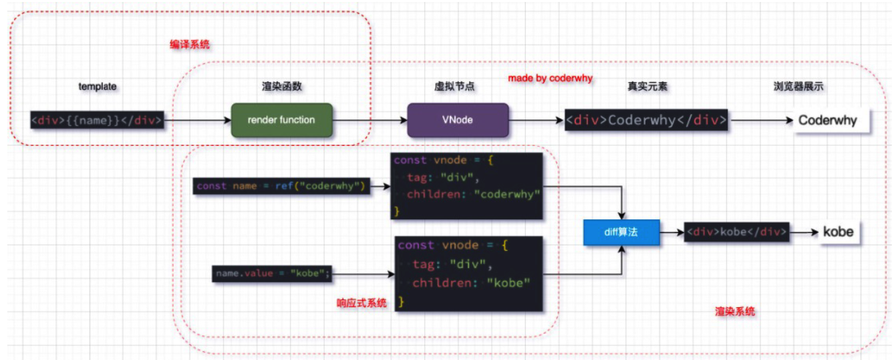

# Vue3源码学习 1
## VDOM
- 性能更好
- 跨平台

## Vue key components
Tempalte -> render() -> VNode -> real DOM -> Browse

- Compiler: compile the tempalte: compiler-sfc
- Runtime / Render: Vnode to DOM
- Reactivity system

## Mini-Vue
忽略 compliter
- render: vnode->DOM
- reactive: diff
- mount

## Render
- h(), return a VNode
- mount(), mount VNode to DOM
- patch(), compare 2 VNodes, process new NVode

# Vue3源码学习 2